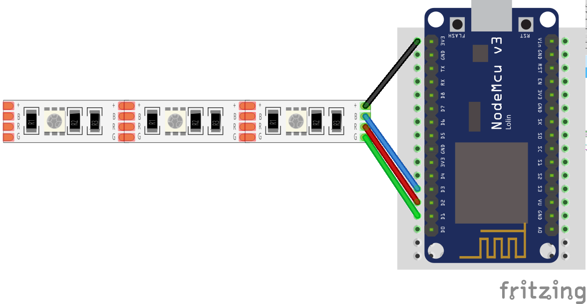

==============
Hardware Setup
==============

This page describes the hardware setup for the tallies.
How to build the tallies and how to build and flash new firmware to the tallies.

Build a Tally
=============

For the tallies a classic ``RGB`` ledstrip is used instead of the more modern ``WS2812B`` standard. This ledstrip is connected as follows:

Build the firmware
==================

In order to build the firmware a ``Toolchain`` for cross compilation is required. 
This toolchain is provided in the repository in ``nodemcu-firmware/``. 
To build the code for the tallies, navigate to ``wifi-tally/tally/`` and run ``make``.

.. code-block:: console

    $ make
    # if it compiles it is syntactically valid
    ../../nodemcu-firmware/luac.cross -o /dev/null src/init.lua
    "busted"
    ●●●●●●●●●●●●●●●●●●●●●●●●●●●●●●●●●●●●●●●●●●●●●●●●●●●●●●●●●●●●●●●●●●●●●●●●●●●●●●●●●●●●●●●●●●●
    91 successes / 0 failures / 0 errors / 0 pending : 0.23373 seconds

The resulting files are in the ``out/`` folder.

Flash the firmware
==================
To flash the firmware, first put the device in flash mode. 
You can do this by pressing and hodling the ``FLASH`` button and presing the ``RST`` button. 
After that you can release the ``FLASH`` button. 
Next, navigate to ``../wifi-tally/firmware`` and run ``install_firmware.sh``. 

.. code-block:: console

    $ ./install_firmware.sh 
    esptool.py v4.4
    Serial port /dev/ttyUSB0
    Connecting....
    Detecting chip type... Unsupported detection protocol, switching and trying again...
    Connecting....
    Detecting chip type... ESP8266
    Chip is ESP8266EX
    Features: WiFi
    Crystal is 26MHz
    MAC: 50:02:91:fd:ca:0a
    Uploading stub...
    Running stub...
    Stub running...
    Configuring flash size...
    Flash will be erased from 0x00000000 to 0x00070fff...
    Flash params set to 0x0020
    Compressed 462848 bytes to 301339...
    Wrote 462848 bytes (301339 compressed) at 0x00000000 in 26.7 seconds (effective 138.9 kbit/s)...
    Hash of data verified.

    Leaving...

.. note:: 
    If you receive an error about permissions, run ``sudo -E ./install_firmware.sh`` to mitigate permissions for the USB device. Also look in the ``troubleshooting`` section if you keep having issues.

Flash the Application
=====================
Navigate to ``wifi-tally/tally`` and run ``install_application.sh``.

.. note:: 
    Make sure to edit the ``out/tally-settings.ini`` for the correct wifi SSID and password.

.. code:: console

    $ ./install_application.sh          
    opening port /dev/ttyUSB0 with 115200 baud
    Preparing esp for transfer.
    Transferring out/my-app.lc as out/my-app.lc
    Transferring out/my-led.lc as out/my-led.lc
    Transferring out/my-log-buffer.lc as out/my-log-buffer.lc
    Transferring out/my-log.lc as out/my-log.lc
    Transferring out/my-settings.lc as out/my-settings.lc
    Transferring out/my-tally.lc as out/my-tally.lc
    Transferring out/my-wifi.lc as out/my-wifi.lc
    Transferring out/tally-settings.ini as out/tally-settings.ini
    All done!

The tally is ready!