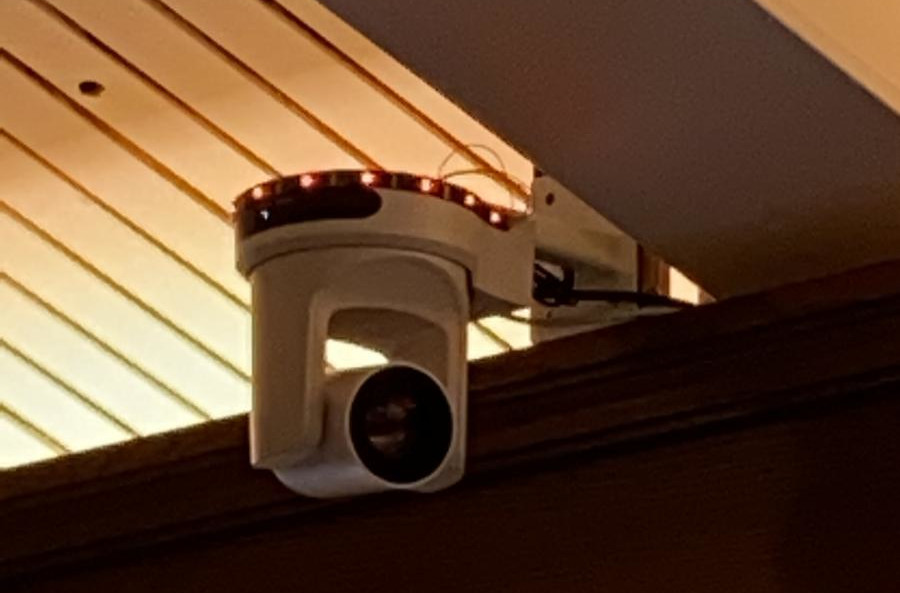

.. Oostendam Tallies documentation master file, created by
   sphinx-quickstart on Mon Jan 23 22:14:59 2023.
   You can adapt this file completely to your liking, but it should at least
   contain the root `toctree` directive.

Tallies in Oostendam
====================

.. toctree::
   :maxdepth: 2
   :caption: Build:

   overview.rst
   hardware/index.rst
   server/index.rst

.. toctree::
   :maxdepth: 2
   :caption: Development:

   patches.rst
   troubleshooting.rst

.. toctree::
   :maxdepth: 2
   :caption: Migrating:

   migration.rst

Introduction
============

This document contains the documentation for the tallies used in the `Immanuelkapel in Oostendam <https://kerkdienstgemist.nl/stations/2112-Immanuelkapel>`_. 
The goal in this project is to provide *cheap* indicator lights to show which camera is active during the service.
This way the minister knows which of the camera's is active and use it during the service.

This project relies heavily on an `existing project on github <https://github.com/wifi-tally/wifi-tally/>`_. 
The main difference between this code and the project on github is the behaviour of the tally lights. 

Contact
*******

To contact our church you can see our contact details below:

+-------------+----------------------------+
|             | Immanuëlkapel (Oostendam)  |
+=============+============================+
| Street      | Pruimendijk 99             |
+-------------+----------------------------+
| Postal code | 2989 AH Ridderkerk         |
+-------------+----------------------------+
| Phone       | 078-6819880                |
+-------------+----------------------------+

.. include:: dependencies.rst

Result
******
The tally in our Church in Oostendam:

